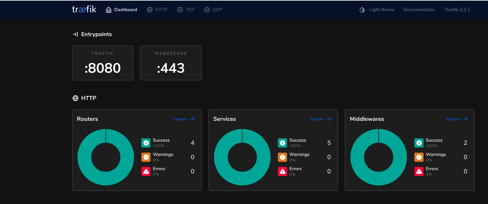
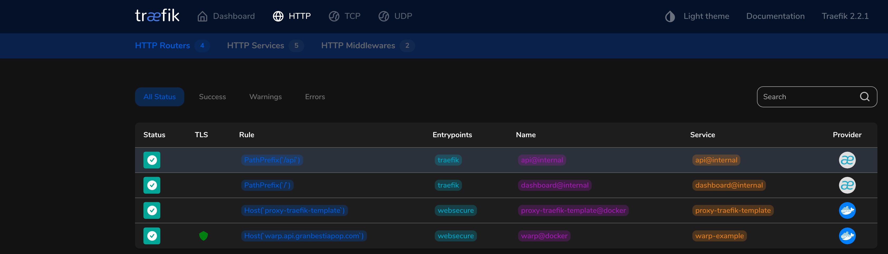

# Traefik template
## docker-compose
En este caso se utiliza docker compose para generar una instancia de traefik con la finalidad de resolver certificados SSL de forma automática utilizando el servicio de lets encrypt. Para este caso se utilizó como referencia el siguiente enlace (https://docs.traefik.io/user-guides/docker-compose/acme-tls/).

### Run
```
docker-compose up -d
```

Notar que el servico de traefik quedó expuesto en los puertos default http y https, así como también en el puerto 8081 (puede utilizarse 8080) para exponer la interfaz web de traefic.

### Web interface 
En la instancia acceder a http://localhost:8090


Se pueden visualizar los recursos http hasta el momento.



## Aplicación de ejemplo 
En el directorio example podemos encontrar una aplicación rust que se expone en el puerto 3030, la aplicación consiste en una API simple que devuelve "hello name" a través del recurso http://localhost:3030/hello/name, para demostrar la funcionalidad de traefik nos bastará con este ejemplo.
Esta es la configuración en el docker-compose que se debe tener el cuenta para exponer los servicios de forma automágica por medio de traefik.
```
    labels:
      - "traefik.enable=true"
      - "traefik.http.routers.warp.rule=Host(`warp.api.granbestiapop.com`)"
      - "traefik.http.routers.warp.entrypoints=websecure"
      - "traefik.http.routers.warp.tls.certresolver=myresolver"
```

La primer línea hace visible la aplicación para que pueda ser descubierta por le servicio de traefik, debido a que la configuración del proxy por default no realiza el routeo de forma automática a través del del header host como medida de seguridad. Fácilmente se puede crear una regla de ruta para acceder a todos los servicios de forma automática utilizando el host correcto.
En la segunda linea describimos la regla de routeo que deriva al servicio, en este caso se utiliza el host warp.api.granbestiapop.com, y como entrypoint utilizamos por default websecure. El manejador del certificados SSL lo provee ```myresolver``` previamente configurado en el servico traefik, el cual utiliza como proveedor a lets encrypt de forma dinámica. 
Notar que en este caso se resuelve un certificado para cada subdominio, aunque existe la posibilidad de crear un certificado wildcard para un conjunto de servicios previamente definidos.


### Deploy
```
docker-compose -f example/docker-compose.example.yml up -d
```

De esta forma tenemos el servicio en rust con menos de 1 MB de memoria de utilización.

```
curl https://warp.api.granbestiapop.com/hello/rust

```

Visitando el dominio desde el navegador web se puede validar el certificado accediendo a dicho recurso.

Ahora se puede crear una nueva aplicación de forma segura únicamente incluyendo los labels en el contenedor de forma correcta. Traefik se encargará de realizar el discovery de forma automática, firmado los certificados con lets encrypt de forma automática para cada subdomino desplegado.

### Conclusiones
* Se logró configurar de forma relativamente sencilla un reverse proxy que gestiona de forma automática certificados SSL.
* Si comparamos con nginx donde es necesario hacer explícita la regla para realizar un proxy pass hacia nuestro nuevo servicio, resulta mucho más sencillo y el despliegue con exposición del microservico no depende de agregar una nueva regla, basta con realizar el deploy con el conjunto de reglas en el Dockerfile o docker-compose y traefik se encargará del resto.
* Para este ejemplo se utilizaron reglas dependientes del host, lo que genera tener múltiples subdominios para cada microservicio. Esto se puede resolver fácilmente utilizando otros enfoques, por ejemplo el path del recurso, o el método del recurso http, brindando de esta forma una herramienta poderosa para realizar el routeo de forma sencilla. Esto nos permite como por ejemplo, tener un entorno de test para el microservicio, se puede crear una regla de deploy utilizando un query parameter como por ejemplo env=test y de esta forma redireccionar a un contenedor de prueba sin afectar el entorno productivo. Dependiendo el nivel de granularidad que se busque se pueden hacer reglas para mantener el versionado de los microservicios, imaginar el caso donde se depreca totalmente un servicio pero debe continuar sirviendo requests para plataformas legadas. Se puede crear a través de un header la versión del servicio y redireccionar el tráfico a una instancia que potencialmente será eliminada definitivamente cuando el tráfico tienda a 0. Por más detalles de rutas se puede acceder al siguiente artículo (https://docs.traefik.io/routing/routers/)
* Traefik brinda la posibilidad de agregar middlewares que nos pueden resultar muy útiles en el momento de poner en producción nuestro servicio. Brinda por ejemplo circuit breaker, compresión, ip filtering, chaining, autenticación, rate limiter entre otras. Resultando de suma utilidad en el momento de exponer los microservicios, delegando esta responsabilidad al middleware y no generando reglas de filtrado de ips por ejemplo en nuestra aplicación.